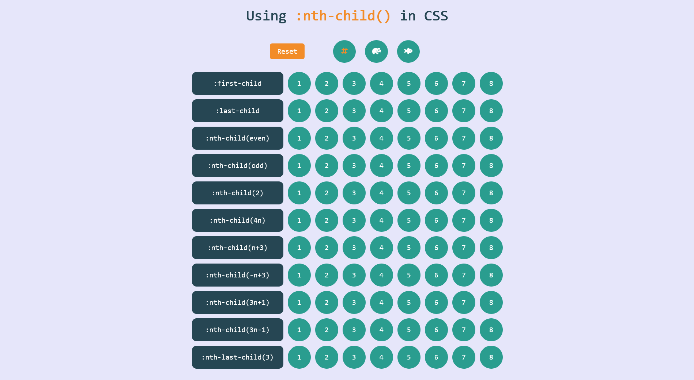

# Using :nth-child() Page

This page was created as part of a challenge in the Front-End Professional group on Telegram

## Table of contents
- [Screenshot](#screenshot)
- [Links](#links)
- [Tasks](#tasks)
- [Using :nth-child() Page Description](#using-nth-child-page-description)
- [Author](#author)

## Screenshot

## Links

[Using :nth-child() Page](https://axinitm.github.io/ODC-Using-nth-child-Page/)

## Tasks
Create a Using :nth-child() Page. 

## Using :nth-child() Page Description
This page demonstrates the use of the :nth-child() pseudo-class in CSS. It includes a table with selectors and elements where various CSS rules can be applied using :nth-child().

The header contains a title and a control panel with a reset button and three radio buttons to select the type of content displayed (digits, hippo, and fish).

The main section includes a table with rows demonstrating different :nth-child selectors (such as :first-child, :last-child, :nth-child(even), etc.). Each row begins with a pseudo-button that allows you to apply the selector to that row.

JavaScript adds interactivity to the page: it changes the row content between numbers and animal icons, resets the page to its original state, and displays tooltips for selected row elements based on the chosen selector etc.

## Author

- Website [Andrei Martinenko](https://www.frontender.biz/)
- GitHub [Andrei Martinenko](https://github.com/AxinitM)

